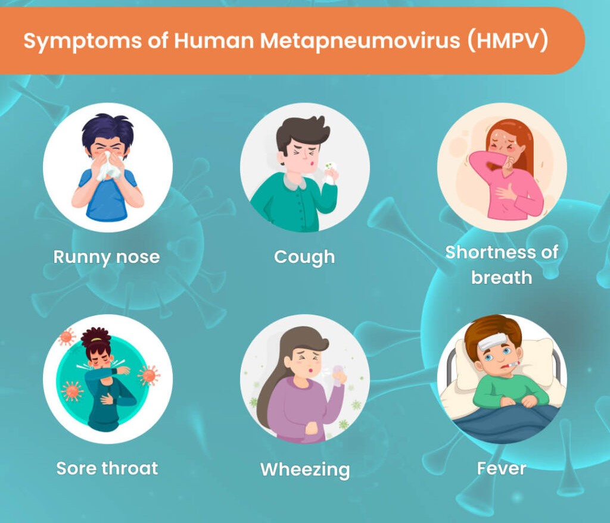
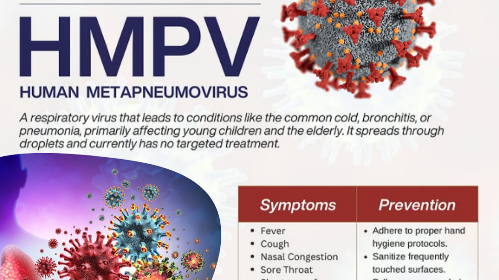

<html lang="en">
<head>
    <meta charset="UTF-8">
    <meta name="viewport" content="width=device-width, initial-scale=1.0">
    <link rel="stylesheet" href="https://maxcdn.bootstrapcdn.com/bootstrap/4.0.0/css/bootstrap.min.css">
    <link rel="stylesheet" href="https://cdnjs.cloudflare.com/ajax/libs/font-awesome/5.15.3/css/all.min.css">
    <link rel="stylesheet" href="style.css">
    </head> 
<body> 
 <!-- Navbar Start -->
    

        

            

                <small><i class="fa fa-map-marker-alt me-2"></i>24 Street,Vector Road,USA</small>
                <small class="ms-4"><i class="fa fa-envelope me-2"></i>NutreX123@gmail.com</small>
            

            

               
 

                    <a href="ghg.html" class="nav-item nav-link">Sign up</a>
     

   

 

<nav class="navbar navbar-expand-lg navbar-light py-lg-0 px-lg-5 wow fadeIn" data-wow-delay="0.1s">
            <a href="index1.html" class="navbar-brand ms-4 ms-lg-0">
                <h1 class="fw-bold text-primary m-0">NutreX</h1>
            </a>
            <button type="button" class="navbar-toggler me-4" data-bs-toggle="collapse" data-bs-target="#navbarCollapse">
                
            </button>
            

                

                    <a href="index1.html" class="nav-item nav-link active">Home</a>
                    <a href="about.html" class="nav-item nav-link">About Us</a>
                    

                        <a href="#" class="nav-link dropdown-toggle" data-bs-toggle="dropdown">Pages</a>
                        

                            <a href="symptoms.html" class="dropdown-item">Symptoms</a>
                            <a href="precaution.html" class="dropdown-item">Precaution</a>
                            <a href="cause.html" class="dropdown-item">Cause</a>
                            <a href="treatment.html" class="dropdown-item">Treatment</a>
                        

                    

                    <a href="contact.html" class="nav-item nav-link">Contact Us</a>
                
 <a href="detector1.html" class="nav-item nav-link">Detector</a>
            

           

                    <a class="btn-sm-square bg-white rounded-circle ms-3" href="">
                        <small class="fa fa-search text-body"></small>
                    </a>
                    <a class="btn-sm-square bg-white rounded-circle ms-3" href="">
                        <small class="fa fa-user text-body"></small>
                    </a>
                    <a class="btn-sm-square bg-white rounded-circle ms-3" href="">
                        <small class="fa fa-shopping-bag text-body"></small>
                    </a>
                

            

        </nav>
    

     <!-- Navbar End -->
    

        

            

                <h2><strong>Human-Metapneumovirus:</strong></h2>
                
Human metapneumovirus(HMPV)is a negative-sense single-stranded RNA virus of the family Pneumoviridae and is closely related to the avian metapneumovirus subgroup C.It was isolated for the first time in 2001 in the Netherlands by using the RAP-PCR (RNA arbitrarily primed PCR) technique for the identification of unknown viruses growing in cultured cells.As of 2016, it was the second most common cause—after respiratory syncytial virus (RSV).

            

        

        

            

                <h2>How was HMPV discovered?</h2>
                <ul>
                    <li>Researchers used electron microscopy and reverse transcription-polymerase chain reaction (RT-PCR) to identify HMPV in stored nasopharyngeal samples.</li>
                    <li>The virus was found to be most closely related to avian metapneumovirus serotype C.</li>
                </ul>
            
         
        

        

            

                <h2>Gallery</h2>
                

                    

                        

                            
                        

                        

                            
                        

                        

                            
                        

                    

                    <a class="carousel-control-prev" href="#carouselExampleControls" role="button" data-slide="prev">
                        
                        Previous
                    </a>
                    <a class="carousel-control-next" href="#carouselExampleControls" role="button" data-slide="next">
                        
                        Next
                    </a>
                

            

        

        

            

                <h2>Impact</h2>
                
1.Human metapneumovirus (hMPV) is a respiratory virus that typically causes mild, cold-like symptoms such as cough, fever, nasal congestion, and wheezing. However, in certain individuals, particularly young children, older adults, and those with weakened immune systems, it can lead to more severe respiratory illnesses like bronchitis or pneumonia.  
                  2.In temperate regions, hMPV primarily spreads during late winter and spring, coinciding with other respiratory viruses like influenza and RSV. Transmission occurs through respiratory droplets from coughing or sneezing, close personal contact, or touching contaminated surfaces and then touching the face.  
                    3.Preventive measures include wearing masks in crowded or poorly ventilated spaces, improving indoor ventilation, regular hand hygiene, and avoiding touching the face with unwashed hands. Currently, there is no specific vaccine or antiviral treatment for hMPV; management focuses on supportive care to relieve symptoms.  
                    4.While hMPV is a common cause of respiratory infections, it generally results in mild illness. However, it can cause more severe disease in infants, older adults, and immunocompromised individuals. Monitoring and preventive measures are essential to protect these vulnerable populations. 
                    

              

        

        

            

                <h2>About Us</h2>
                
The HMPV is a project of a non-profit organization dedicated to providing humanitarian assistance and guidance.
                   Medical Information: It can be used to share up-to-date research on HMPV, diagnostic methods, and treatment options, contributing to the scientific community's understanding of the virus.
                   Updates on Clinical Trials and Findings: For researchers, having an online platform to keep up with new research and breakthroughs regarding HMPV is crucial.
                   Surveys and Data: If integrated with data collection tools, the website could gather valuable data from users regarding the prevalence of HMPV, symptoms, and recovery times, helping to inform public health strategies.     

            

        

 <a href="#" class="nav-link dropdown-toggle" data-bs-toggle="dropdown">Translate into Hindi</a>
        

            

                

                    

                        <h2><strong>मानवी-मेटाप्न्यूमोव्हायरस:</strong></h2>
                    
मानवी-मेटाप्न्यूमोव्हायरस (HMPV) हा न्यूमोव्हिरिडे कुटुंबातील एक नकारात्मक-अर्थाने सिंगल-स्ट्रँडेड RNA विषाणू आहे आणि तो एव्हियन मेटाप्न्यूमोव्हायरस उपसमूह C शी जवळून संबंधित आहे. २००१ मध्ये नेदरलँड्समध्ये प्रथमच RAP-PCR (RNA अनियंत्रितपणे प्राइम्ड PCR) तंत्र वापरून संवर्धित पेशींमध्ये वाढणाऱ्या अज्ञात विषाणूंची ओळख पटवून देण्यात आली. २०१६ पर्यंत, ते दुसरे सर्वात सामान्य कारण होते - श्वसन सिन्सिशियल व्हायरस (RSV) नंतर.

                    

                        

   

                

                <h2>HMPV कसा शोधला गेला?</h2>
                    <ul>
                    <li>संशोधकांनी साठवलेल्या नासोफॅरिंजियल नमुन्यांमध्ये HMPV ओळखण्यासाठी इलेक्ट्रॉन मायक्रोस्कोपी आणि रिव्हर्स ट्रान्सक्रिप्शन-पॉलिमरेज चेन रिएक्शन (RT-PCR) चा वापर केला.</li>
                    <li>हा विषाणू एव्हियन मेटाप्न्यूमोव्हायरस सेरोटाइप सी शी सर्वात जवळून संबंधित असल्याचे आढळून आले.</li>
                    </ul>
                

                    

                        

                            <h2>Gallery</h2>
                            

                                

                                    

                                        
                                    

                                    

                                        
                                    

                                    

                                        
                                    

                                

                                <a class="carousel-control-prev" href="#carouselExampleControls" role="button" data-slide="prev">
                                    
                                    Previous
                                </a>
                                <a class="carousel-control-next" href="#carouselExampleControls" role="button" data-slide="next">
                                    
                                    Next
                                </a>
                            

                        

                    

                

                    <h2>परिणाम</h2>
            
१.ह्युमन मेटाप्न्यूमोव्हायरस (hMPV) हा एक श्वसन विषाणू आहे जो सामान्यतः खोकला, ताप, नाक बंद होणे आणि घरघर यासारख्या सौम्य, सर्दीसारखी लक्षणे निर्माण करतो. तथापि, काही व्यक्तींमध्ये, विशेषतः लहान मुले, वृद्ध प्रौढ आणि कमकुवत रोगप्रतिकारक शक्ती असलेल्यांमध्ये, ते ब्राँकायटिस किंवा न्यूमोनियासारखे अधिक गंभीर श्वसन आजारांना कारणीभूत ठरू शकते.  

२.समशीतोष्ण प्रदेशात, hMPV प्रामुख्याने हिवाळ्याच्या शेवटी आणि वसंत ऋतूमध्ये पसरतो, इन्फ्लूएंझा आणि RSV सारख्या इतर श्वसन विषाणूंसोबत मिळतो. खोकणे किंवा शिंकणे, जवळचा वैयक्तिक संपर्क किंवा दूषित पृष्ठभागांना स्पर्श करणे आणि नंतर चेहऱ्याला स्पर्श करणे यातून श्वसनाच्या थेंबांद्वारे संक्रमण होते.  

३.प्रतिबंधात्मक उपायांमध्ये गर्दीच्या किंवा कमी हवेशीर जागांमध्ये मास्क घालणे, घरातील वायुवीजन सुधारणे, नियमित हातांची स्वच्छता आणि न धुतलेल्या हातांनी चेहरा स्पर्श करणे टाळणे यांचा समावेश आहे. सध्या, hMPV साठी कोणतीही विशिष्ट लस किंवा अँटीव्हायरल उपचार नाही; व्यवस्थापन लक्षणे दूर करण्यासाठी सहाय्यक काळजीवर लक्ष केंद्रित करते.  

४. एचएमपीव्ही हे श्वसन संसर्गाचे एक सामान्य कारण असले तरी, त्यामुळे सामान्यतः सौम्य आजार होतात. तथापि, यामुळे लहान मुले, वृद्ध आणि रोगप्रतिकारक शक्ती कमकुवत असलेल्या व्यक्तींमध्ये अधिक गंभीर आजार होऊ शकतात. या असुरक्षित लोकसंख्येचे संरक्षण करण्यासाठी देखरेख आणि प्रतिबंधात्मक उपाय आवश्यक आहेत. 

              

                

                

            <h2>आमच्याबद्दल</h2>
        
HMPV हा मानवतावादी मदत आणि मार्गदर्शन प्रदान करण्यासाठी समर्पित एका गैर-नफा संस्थेचा प्रकल्प आहे.
            
वैद्यकीय माहिती: HMPV, निदान पद्धती आणि उपचार पर्यायांवरील अद्ययावत संशोधन सामायिक करण्यासाठी याचा वापर केला जाऊ शकतो, ज्यामुळे विषाणूबद्दल वैज्ञानिक समुदायाला समजण्यास मदत होते.

क्लिनिकल चाचण्या आणि निष्कर्षांवरील अद्यतने: संशोधकांसाठी, HMPV संबंधी नवीन संशोधन आणि प्रगती जाणून घेण्यासाठी ऑनलाइन प्लॅटफॉर्म असणे अत्यंत महत्त्वाचे आहे.

सर्वेक्षण आणि डेटा: डेटा संकलन साधनांसह एकत्रित केल्यास, वेबसाइट वापरकर्त्यांकडून HMPV च्या प्रसार, लक्षणे आणि पुनर्प्राप्ती वेळेबद्दल मौल्यवान डेटा गोळा करू शकते, ज्यामुळे सार्वजनिक आरोग्य धोरणांची माहिती देण्यात मदत होते. 

         

            

            
    <!-- Footer Start -->
 

        

            

                

                    <h1 class="fw-bold text-primary mb-4">NutreX 
                    
 Human metapneumovirus (HMPV) is a common virus that usually causes symptoms similar to a cold. If you’re older than 5, you’ve probably already had it at least once. Most of the time, you’ll get better at home in a few days. But sometimes HMPV can cause serious complications. Young children, adults over 65 and people with weakened immune systems are at a higher risk for severe illness. Talk to your healthcare provider if you have any concerns about HMPV.

                    

                        <a class="btn btn-square btn-outline-light rounded-circle me-1" href=""><i class="fab fa-twitter"></i></a>
                        <a class="btn btn-square btn-outline-light rounded-circle me-1" href=""><i class="fab fa-facebook-f"></i></a>
                        <a class="btn btn-square btn-outline-light rounded-circle me-1" href=""><i class="fab fa-youtube"></i></a>
                        <a class="btn btn-square btn-outline-light rounded-circle me-0" href=""><i class="fab fa-linkedin-in"></i></a>
                    

                

                

                    <h4 class="text-light mb-4">Address</h4>
                    
<i class="fa fa-map-marker-alt me-3"></i>24 Street,Vector Road,USA

                    
<i class="fa fa-phone-alt me-3"></i>+086-324-8954

                    
<i class="fa fa-envelope me-3"></i>NutreX123@gmail.com

                

                

                    <h4 class="text-light mb-4">Quick Links</h4>
                    <a class="btn btn-link" href="">About Us</a>
                    <a class="btn btn-link" href="">Contact Us</a>
                    <a class="btn btn-link" href="">Terms & Condition</a>
                    <a class="btn btn-link" href="">Support</a>
                

                

                    <h4 class="text-light mb-4">Newsletter</h4>
                    
For more updates just Connect with us via sending message or sign up with your email. We will always there for yourself.

                

        

            

                

                    

                        &copy; <a href="#">NutreX</a>, All Right Reserved.
                    

                  

            

        

         
      
